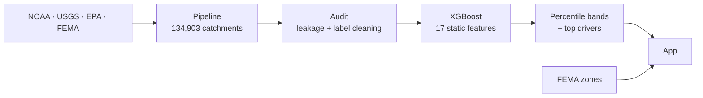

# FloodLens

**A catchment-level flood susceptibility score for the U.S. East Coast.**

FloodLens ranks 134,903 coastal catchments, from Maine to Florida, by how intense their runoff is likely to be, using only permanent features of the landscape. Enter an address, get a percentile band, see what's driving it, and compare it against FEMA's flood zone.

`134,903 catchments` · `14 states + PA/DC headwaters` · `17 features` · `XGBoost` · `4 held-out basins for testing`

---

## Why it exists

Flood risk is usually communicated as a single yes/no: is this parcel inside a FEMA flood zone? That leaves two gaps.

- **Coverage.** Some areas have no FEMA map at all (3,557 catchments in our study area). Unmapped does not mean safe.
- **Context.** A zone label doesn't say how a watershed compares with the rest of the coast, or why.

FloodLens adds a comparable, explainable score for every catchment, and is explicit about where it can't give one.

---

## What it does

- **Locates** an address in its NHDPlus catchment.
- **Ranks** that catchment against all East Coast catchments as a percentile band.
- **Explains** the score with the top drivers (slope, impervious cover, rainfall depth, terrain, and more).
- **Compares** the score with the FEMA flood zone, and flags where FEMA has no map or the model doesn't apply.

It is a relative ranking tool. It is **not** a flood forecast, an inundation map, or a storm-surge model.

---

## How it works



1. **Collect.** A parallel pipeline joins NOAA's National Water Model, EPA StreamCat, USGS NHDPlus, NOAA Atlas 14 rainfall statistics, and FEMA flood maps onto every catchment within 50 miles of the coast.
2. **Define the target.** For each catchment, the National Water Model's simulated peak flow divided by drainage area (log-scaled) over water years 1980–2022.
3. **Learn.** A gradient-boosted model predicts that target from static landscape features only: terrain, soils and runoff, land cover, rainfall depth, distance to coast, and elevation above the channel.
4. **Score.** Every catchment gets a percentile rank and a five-band category, plus the features pushing it up or down.
5. **Serve.** The app looks up an address and shows the band, the drivers, and the FEMA zone side by side.

---

## Data

| Source | Role |
|---|---|
| NOAA National Water Model retrospective | Target (simulated peak flow) |
| EPA StreamCat | Land cover, runoff, baseflow, precipitation, TWI, elevation |
| USGS NHDPlusV2 | Catchments, drainage area, slope, flowline elevation, coastline |
| NOAA Atlas 14 | 10-yr and 100-yr, 24-hour rainfall depths |
| FEMA NFHL | Comparison and display only, never a model input |
| USGS NWIS streamgages | Independent validation against observed flow |

**Dataset:** 134,903 catchments, of which 114,502 form the clean modeling set (93,948 train, 20,554 test). The rest are scored but never trained or evaluated on. About 13,000 tidal and shoreline catchments have no National Water Model coverage, so the app shows their FEMA zone rather than a score.

---

## Evaluation

The model is tested on **whole river basins it never saw**: New England (0110), Mid-Atlantic (0203), Carolinas–Georgia (0302), and Atlantic Florida (0309). Random splits would flatter the results, since neighboring catchments are nearly identical. The protocol, metrics, and success criteria were written before any tuning (`docs/evaluation_protocol.md`), and the test set is scored once.

Preliminary cross-validation on the training basins (default XGBoost, test set untouched):

| Measure | Value |
|---|---|
| Rank correlation, all 17 features | ~0.45 |
| Rank correlation, without drainage-area features | 0.29 |
| Rank correlation, drainage area regressed out | 0.34 |
| 3-feature linear baseline | 0.28 |


---

## Design decisions worth knowing

- **Static features only.** The model can't see weather, so it ranks susceptibility, not events.
- **FEMA is never an input.** It's the independent comparison, not a shortcut.
- **"Unmapped" is not "safe."** Catchments with no FEMA data are never filled with zeros.
- **Noisy labels are excluded, not patched.** Tiny-area, zero-flow, and implausible-ratio catchments are flagged and left out of training.
- **Size is reported honestly.** Results always show the full model, a no-area ablation, and a size-adjusted rank correlation side by side.
- **Two shortcuts were tested and removed.** Tropical-storm exposure acted as a location proxy (a plain-latitude control matched its gain), and full HAND rasters weren't worth ~40 GB, so a lightweight elevation-above-channel proxy is used and labeled as one.

---

## Limitations

- The target is simulated, not observed flooding.
- Tidal and storm-surge flooding are not modeled. Those catchments show FEMA zones instead.
- Flow per unit area depends strongly on catchment size, so absolute values are less meaningful than relative rank.
- Very small and very dry basins are excluded from training, so scores there are less reliable.
- Dams, storm timing, and local drainage infrastructure are not represented.
- Test basins differ substantially from training basins in climate and terrain, so expect held-out scores below cross-validation scores.

Details: `docs/README_modeling_handoff.md`.

---

## Repository

```
app/                        the FloodLens app
pipeline/                   data collection and assembly
config/feature_policy.yaml  allowed features, exclusions, flags
data/processed/             frozen dataset, split manifest (raw data not committed)
models/                     final model and per-catchment scores
docs/                       audit report, evaluation protocol, data dictionary
TECHNICAL_OVERVIEW.md       developer-level detail
```


---

## Credits

Built on public datasets from NOAA, USGS, EPA, and FEMA. Please follow each provider's terms.
